# 

> [!NOTE]
> *This repository serves as a public representation of a privately maintained project. It is intended purely for portfolio demonstration purposes, showcasing various functionalities and design principles implemented in the original application. This project is not intended for re-production, and portions of relevant code may be excluded.*

"**Cinemax'd**" is my personal-use database application for logging movies and television series I've seen, or would like to see. It's built using [Django](https://www.djangoproject.com/) and operates on a local SQLite3 database. The relational database schema is designed to maintain relationships between movies and other data, such as cast, awards, genres, and more.

This data is parsed and managed by [entry.py](./example/entry.py), which integrates information from the [TMDB](https://developer.themoviedb.org/docs/getting-started), [OMDB](https://www.omdbapi.com/), and [Wikidata](https://www.wikidata.org/wiki/Wikidata:REST_API) APIs. Additionally, web-scraping and data manipulation techniques are employed to gather review scores and awards data from other sources when necessary.

The front-end design is primarily crafted using Django's built-in templating language. To enhance the user interface, I incorporated [Bootstrap 5](https://getbootstrap.com/), [jQuery](https://jquery.com/), and [jQuery UI](https://jqueryui.com/). Styling is managed with [SASS](https://sass-lang.com/), and charts are all visualized with [amCharts5](https://www.amcharts.com/).

## :movie_camera: Features:

### The Dashboard

As the front page of the entire project and the primary user interface, the dashboard utilizes AJAX requests to render dynamically on scroll. This approach allows multiple sections, featuring different data and visualizations, to load more efficiently. Initially, each section was designed as its own unique page, but this dynamic rendering style resulted in a more seamless and fluid user experience.

    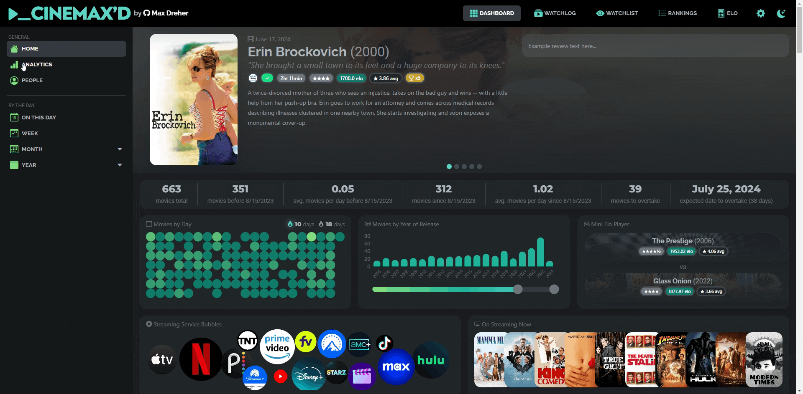
    
<i>Dashboard page scrolling functionality in use.</i>

Each section of the Dashboard presents different data and statistics on various subjects. These sections include tables, figures and interactive components designed to visualize and convey the information effectively.

    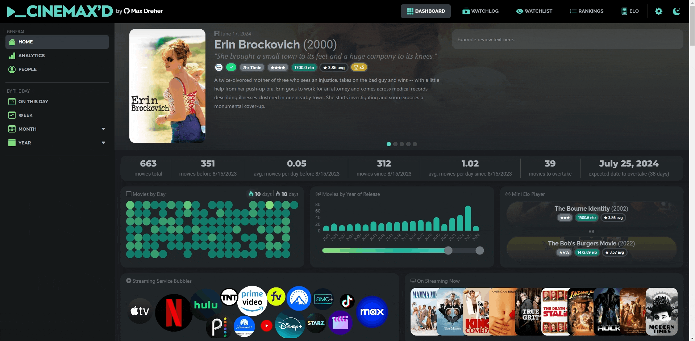
    
<i>Interactive elements on the Home page.</i>

### Watchlist & Watchlog

The Watchlist and Watchlog serve as interactive, fully filterable representations of any movie that has been logged. The Watchlog is a list of everything that's ever been seen, while the Watchlist includes everything still on my to-do list.

The functionality for the tables is powered by the [DataTables](https://datatables.net/) libary, with the [SearchPanes](https://datatables.net/extensions/searchpanes/) extension providing filtering capabilities. These elements have been heavily customized to fit this use case. The entry form is processed via AJAX, refreshing the table and search panes without reloading the entire page.

    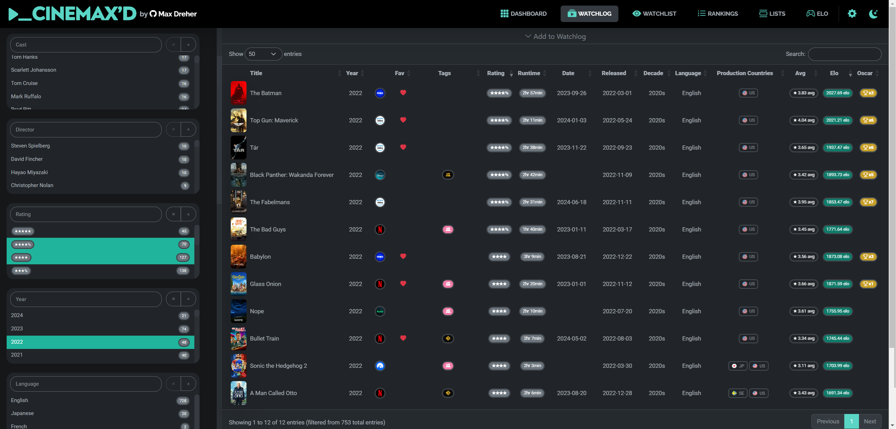
    
<i>The Watchlog page filtered by movies released in 2022, rated between 4.0 - 4.5 stars, ordered by rating.</i>

These pages feature slightly different data and have unique input forms, as the Watchlog demands more user input. Both pages make API calls to provide an 'auto-fill' functionality when searching for a specific movie, replacing the previous search method.

    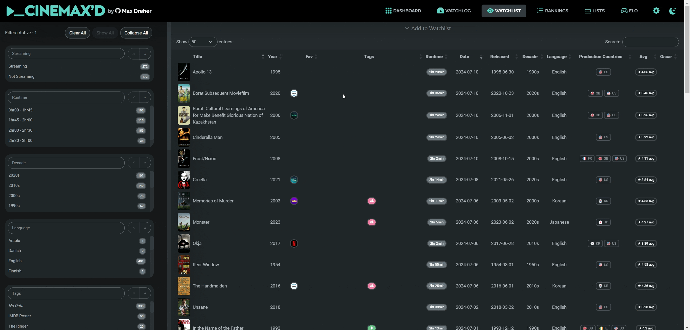
    
<i>An example submission to the Watchlist.</i>

### Rankings & Lists

The Lists page allows me to create custom lists of movies, such as an ordered ranking of movies I've seen with another person or a ranking of my favorite movie posters.

    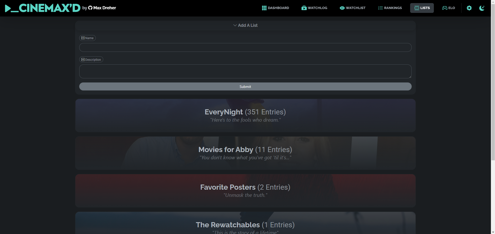
    
<i>The Lists page.</i>

Each list uses [jQuery UI](https://jqueryui.com/) to allow items to be drag-and-droppable for ordering. These lists are a lightweight extension of the Rankings page, which was designed to track every movie seen while attempting to watch one movie every day. This page includes additional features such as a button to collapse the list into smaller elements and a few extra data points.

    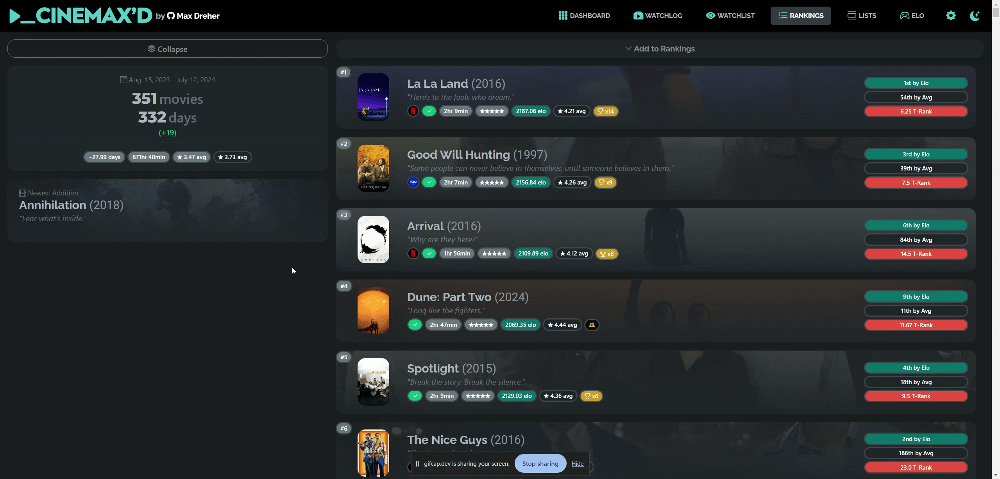
    
<i>Example usage of the Rankings page</i>

### Elo

Early on, I encountered a problem when attempting to rate each movie I logged on a 10-point scale: the ratings often needed to be changed or re-contextualized over time. A movie I initially rated 10/10 might slide to a 9/10 as I find other films deserving of a perfect score. The same often happened in reverse.

To address this, I implemented an Elo algorithm, which maintains a continuous rating scale that is only altered by head-to-head matchups. A movie is assigned a base value when initially rated (1/10 is 1000 Elo, 10/10 is 1900 Elo, increasing by 100 for each rating point). Movies are then randomly selected and given an opponent within ±100 Elo.

    
    
<i>Example matchups on the Elo page</i>

The scores are calculated using a very traditional Elo algorithm where $K = 32$, meaning a movie's rating can change no more than 32 points in a single matchup. This can be expressed for Movies $A$ and $B$, with current Elo scores of $E_{A}$ and $E_{B}$ as,

$$P_{A} = \frac{1}{1+10^{(E_{B} - E_{A})/400}} \quad \quad P_{B} = \frac{1}{1+10^{(E_{A} - E_{B})/400}}$$

Where $P_{A}$ and $P_{B}$ are the probabilities of Movie $A$ or $B$ winning, respectively. These values complement each other and can also be expressed as:

$$ P_{A} = 1 - P_{B} \quad \quad P_{B} = 1 - P_{A} $$

Once these values are known, the results of the matchup will increase and decrease their Elo ratings relative to their probabilities of winning. If Movie $A$ wins, this can be expressed as:

$$ E^\prime_{A} = E_{A} + K \cdot (1 - P_{A}) \quad \quad E^\prime_{B} = E_{B} + K \cdot (0 - P_{B}) $$

For example, if Movie $A$ has an initial Elo rating of 1900, and Movie $B$ has an intial Elo rating of 1600. Their probabilities of winning would be,

$$
P_{A} \approx 0.85 \quad \quad P_{B} \approx 0.15
$$

Assuming Movie $A$ wins, their resulting scores would be,

$$
E^\prime_{A} = 1904.80 \quad \quad E^\prime_{B} = 1595.2
$$

Meaning each film was modified by ±4.8 points.

### Movie Popouts
From any page in the application, clicking on a movie's poster or title will trigger an off-canvas element displaying detailed information about the film.

    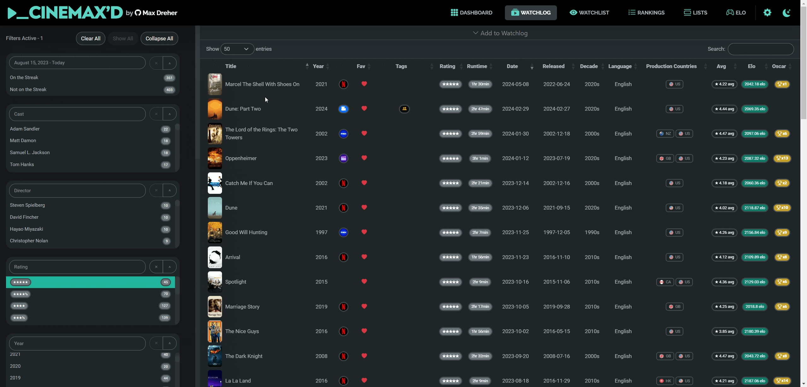
    
<i>The offcanvas element for 'Marcel the Shell With Shoes On'</i>

Several interactable modals can be activated from within the off-canvas element:

    <table>
        <tr>
            <td align="center">
                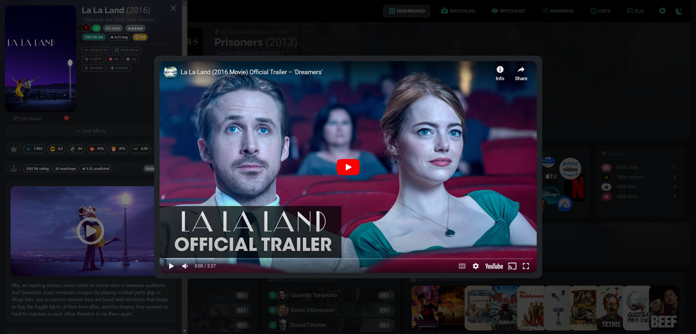
                <i>Trailer modal for 'La La Land'</i>
            </td>
            <td align="center">
                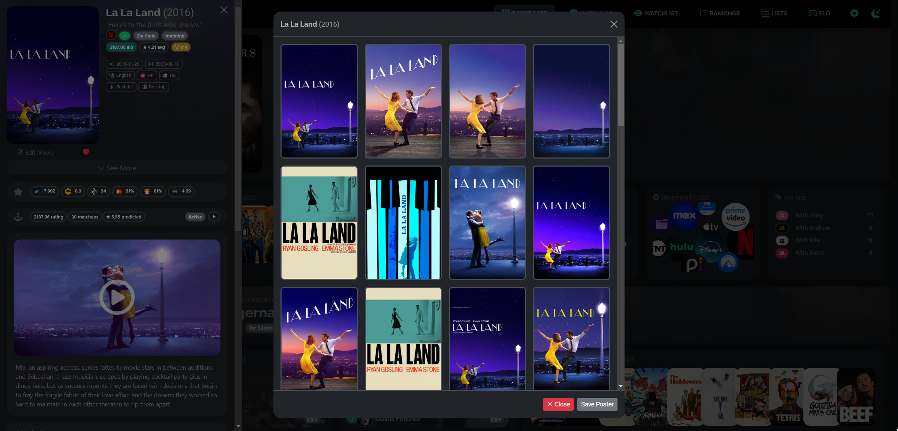
                <i>Custom poster selection modal for 'La La Land'</i>
            </td>
        </tr>
        <tr>
            <td align="center">
                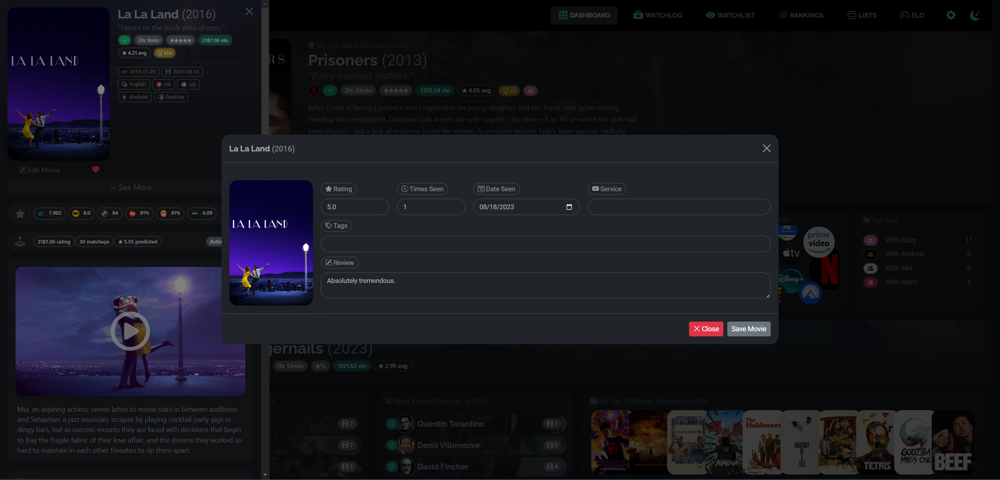
                <i>Edit movie modal for 'La La Land'</i>
            </td>
            <td align="center">
                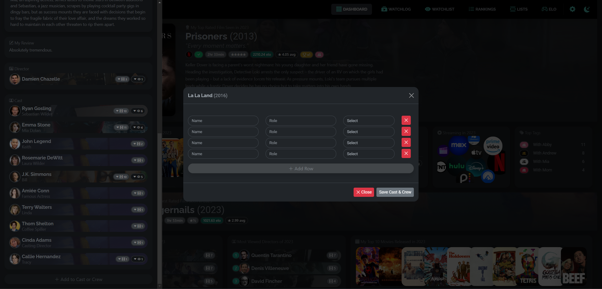
                <i>Add to cast modal for 'La La Land'</i>
            </td>
        </tr>
    </table>

Additionally, there is a modal for running Elo matchups similar to the Elo page. In this modal, movies within ±100 Elo are randomly selected to compete against the chosen film. This helps reduce bias if a movie isn't selected frequently, and mitigates the variance in match count between movies entered at different times.

    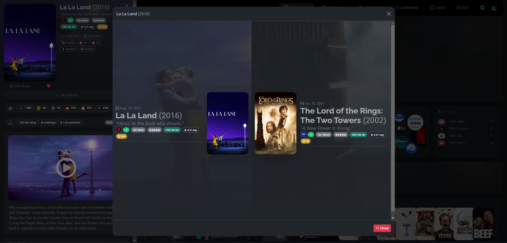
    
<i>Specific elo matchup modal for 'La La Land'</i>

### People Popouts

Just as movie titles and posters can be clicked, names and photos of people will also trigger an off-canvas element displaying detailed information about them as both directors and actors.

    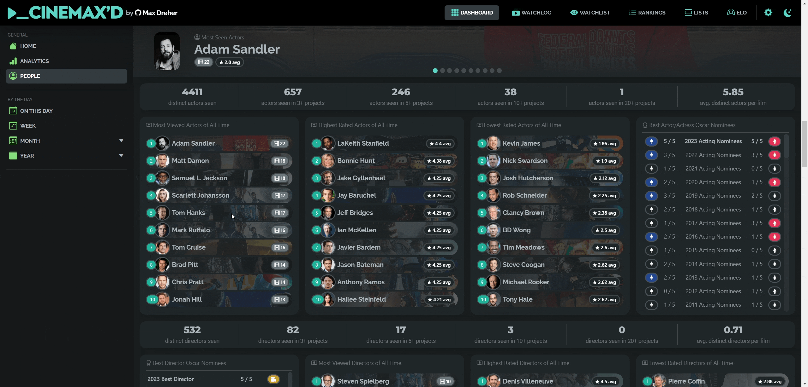
    
<i>The off-canvas element for Tom Hanks.</i>

## :desktop_computer: Database Design

All of my models are built through Django, and can be summarized by the following relational database schema:

    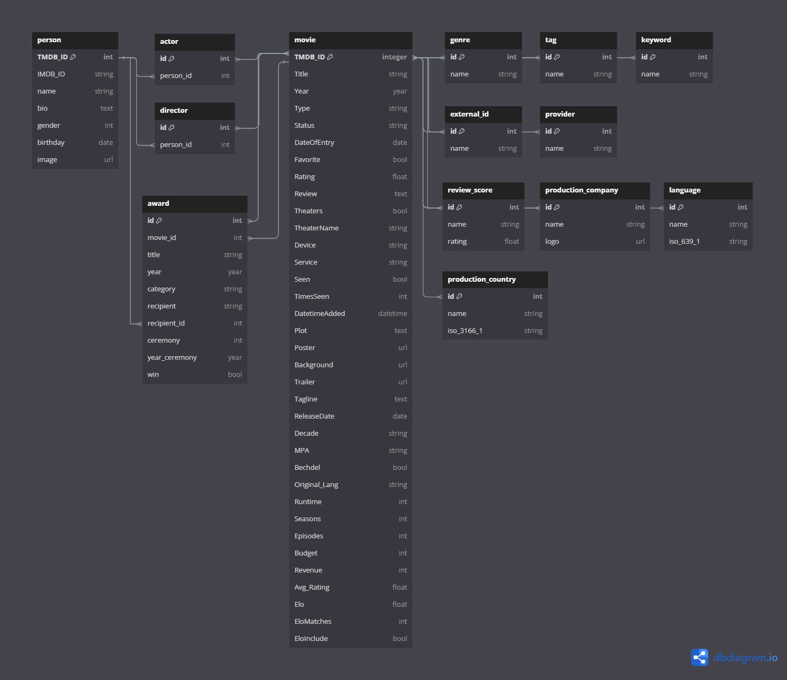
    
<i>An Entity Relationship Diagram describing the models.</i>

As mentioned previously, when a movie is submitted to the database, [entry.py](./example/entry.py) handles all data collection and parsing. Most of the data is sourced from the [TMDB API](https://developer.themoviedb.org/docs/getting-started), and then manipulated to meet certain constraints. For example, I only handle the types "series" and "movie," whereas TMDB uses "tv" and "movie." TMDB's data is very robust, allowing me to populate the majority of my fields from their data. Almost all of the models, aside from "movie" and "award," are populated entirely by the TMDB API.

However, while TMDB's API provides a wealth of information, it is no more than I could get by using their native service. This led me to integrate other data pipelines into my project to ensure that the information I have access to exceeds that which I could get from any particular service.

The [OMDB API](https://www.omdbapi.com/) used to be my primary data source, but it is now only used to collect additional external review scores. For certain movies, the Rotten Tomatoes, Metacritic, and IMDb scores are stored by the OMDB API. In cases where these scores are available, they are used. Otherwise, as a failsafe, the review scores are collected via web scraping.

The [Wikidata API](https://www.wikidata.org/wiki/Wikidata:REST_API) was my most recent addition to the project. Initially, this was in hopes of addressing a frustrating oversight within the data collection process. By the current design, there is no way to quickly filter for movies that all exist in the same franchise. In many cases, this can be solved by querying for titles, production companies, or even a combination of both. However, there are cases in which that is not possible. Take, for instance, 'Star Wars.' There are several films and series within this universe, but not all of them contain 'Star Wars' in the title, and they are not all produced by the same company. Wikidata stores data that I hoped would help address this problem, and in some cases, it has. However, the data is not consistent across all pages, leaving certain franchises incomplete or non-existent. Presently, aside from manual data entry, I have not found a comprehensive solution to this problem.

However, integrating Wikidata's API did allow the addition of new fields, such as a boolean value for whether a film passes the [Bechdel Test](https://en.wikipedia.org/wiki/Bechdel_test), and more external url's than either other API offer.

## :trophy: The Oscars

A portion of data overlooked by all of my sources was awards, specifically the Oscars. To resolve this, I utilized an [Oscar Award Dataset](https://www.kaggle.com/datasets/unanimad/the-oscar-award/data) from [Kaggle](https://www.kaggle.com/). Because this data is static and only changes once annually, it allowed me to load all historical Oscar awards into my database with minimal intervention necessary to update it each year.

The data provided had to be manipulated for this purpose. It was first parsed from CSV format into a JSON file, which standardized several factors, most notably category names. I had to create a set of mappings because the official names of categories at the Oscars have changed frequently, even when representing the same award (e.g., Outstanding Picture, Best Motion Picture, Best Picture).

From there, I utilized the same API searching functionality used when entering a movie to the Watchlist/Watchlog to match each award to the TMDB ID of the winning film. Thus, if a movie is entered in to the database, a relationship can be created by quickly checking the key, preventing any possible faults due to slight title mismatches. This data was then loaded in to the SQLite3 database, and many-to-many relationships were created between movies that had already been added.

Because every award is entered in to the database, even for films that haven't been entered to the Watchlist or the Watchlog, I was able to create checklist elements for different awards. Currently there are checklists for Best Picture Nominees, Best Animated Feature Nominees, Best Actor/Actress Nominees, and Best Director Nominees.

    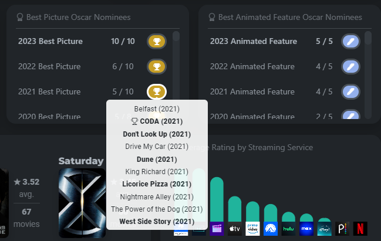
    
<i>A tooltip element for the Best Picture Checklist.</i>

## :rewind: A Look Back

This project was inspired simply by curiosity when I started attempting to watch a movie every day for a year, starting on August 15, 2023. Initially, I used [Letterboxd.com](https://letterboxd.com/), a site that continues to serve as inspiration for many of my own features. However, I wanted the freedom to curate my own data, so I started to maintaining a complex spreadsheet, built using the TMDB and OMDB APIs. Many of the current pages are iterations upon early implementations from this very spreadsheet.

    <table>
        <tr>
            <td align="center">
                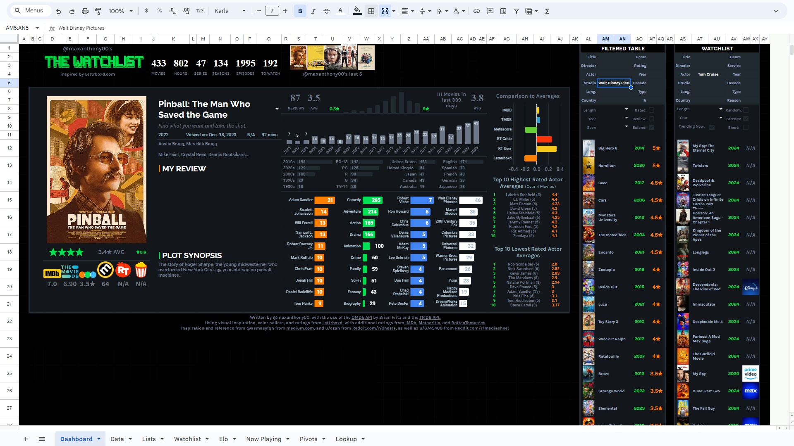
                <i>The Dashboard page of the spreadsheet.</i>
            </td>
            <td align="center">
                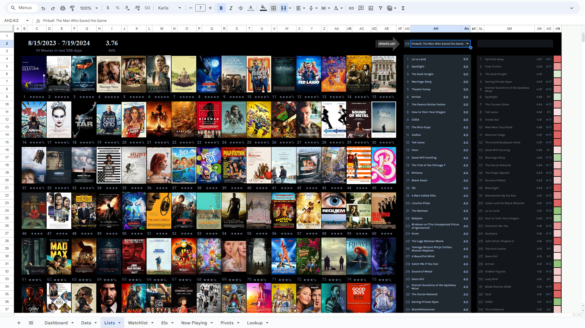
                <i>The Rankings page of the spreadsheet.</i>
            </td>
        </tr>
        <tr>
            <td align="center">
                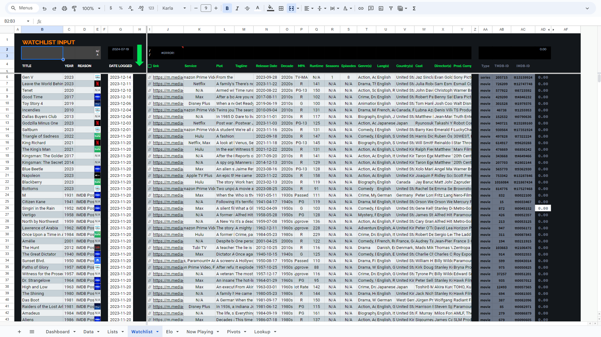
                <i>The Watchlist page of the spreadsheet.</i>
            </td>
            <td align="center">
                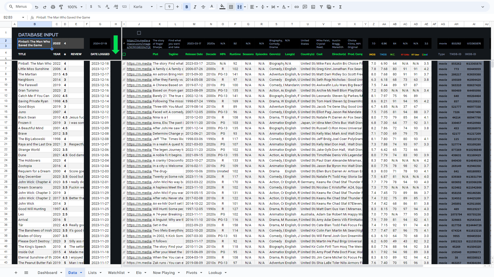
                <i>The Watchlog page of the spreadsheet.</i>
            </td>
        </tr>
    </table>

Ultimately, it was clear that I was outgrowing the functional capabilities of a spreadsheet, and I wanted the flexibility to create more dynamic and interactive elements.

This led me to start this Django project in early December 2023. By Dec. 31, 2023, I had a working implementation of the Dashboard and Watchlist/Watchlog pages.

    <table>
        <tr>
            <td align="center">
                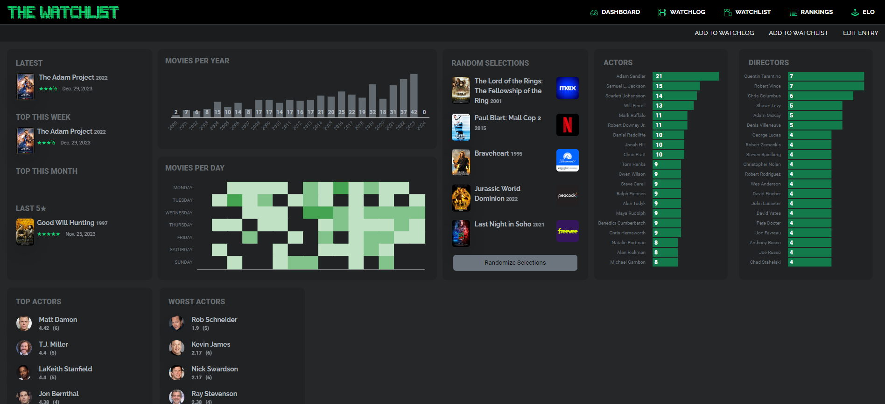
                <i>The Dashboard page as of Dec. 31, 2023.</i>
            </td>
            <td align="center">
                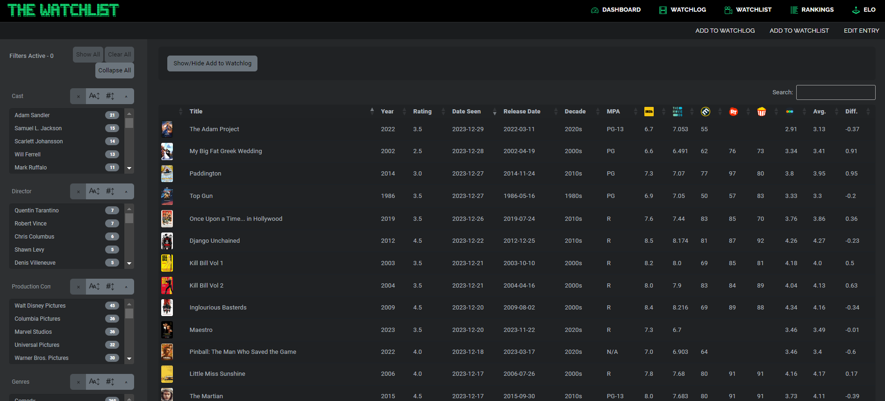
                <i>The Watchlog page as of Dec. 31, 2023.</i>
            </td>
        </tr>
    </table>

By the end of January, the Dashboard and Watchlog had seen substantial revisions. Additionally, the first version of the Rankings page, and the Movie Off-Canvas elements were added.

    <table>
        <tr>
            <td align="center">
                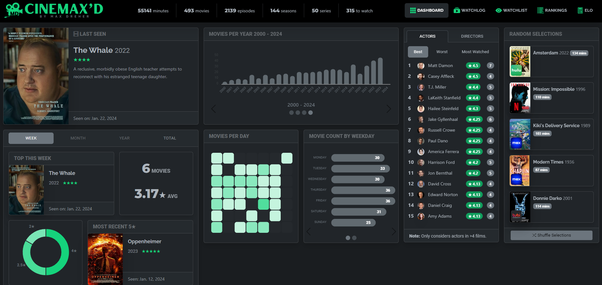
                <i>The Dashboard page as of Jan. 24, 2024.</i>
            </td>
            <td align="center">
                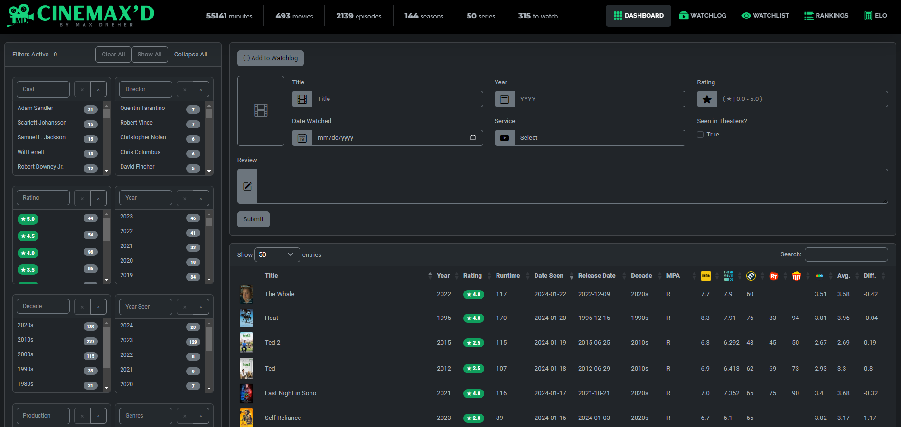
                <i>The Watchlog page as of Jan. 24, 2024.</i>
            </td>
        </tr>
        <tr>
            <td align="center">
                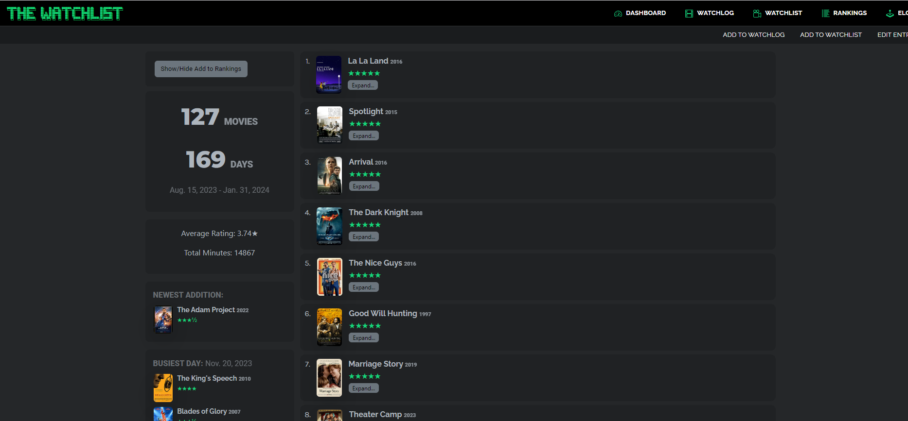
                <i>The Rankings page as of Jan. 31, 2024.</i>
            </td>
            <td align="center">
                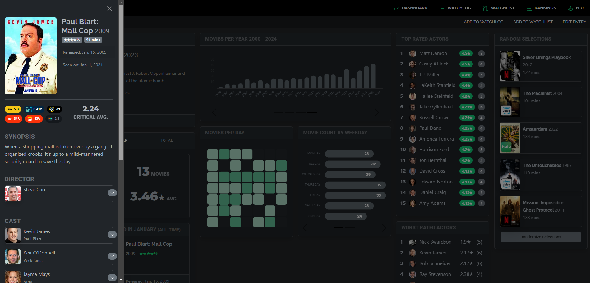
                <i>An Off-Canvas element for 'Paul Blart: Mall Cop' as of Jan. 24, 2024.</i>
            </td>
        </tr>
    </table>

The first iteration of this repository was uploaded in February 2024, which had the first working implementation of the Elo page, Offcanvas Elements for people, and updates to the other pages.

    <table>
        <tr>
            <td align="center">
                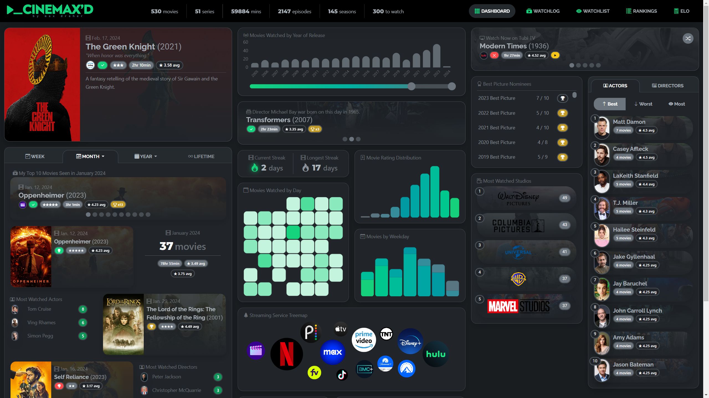
                <i>The Dashboard page as of Feb. 17, 2024.</i>
            </td>
            <td align="center">
                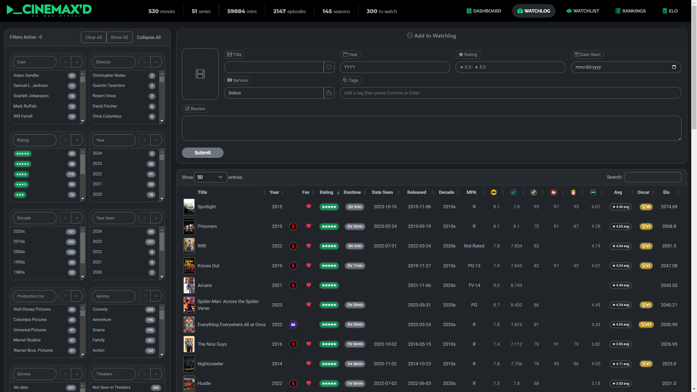
                <i>The Watchlog page as of Feb. 17, 2024.</i>
            </td>
        </tr>
        <tr>
            <td align="center">
                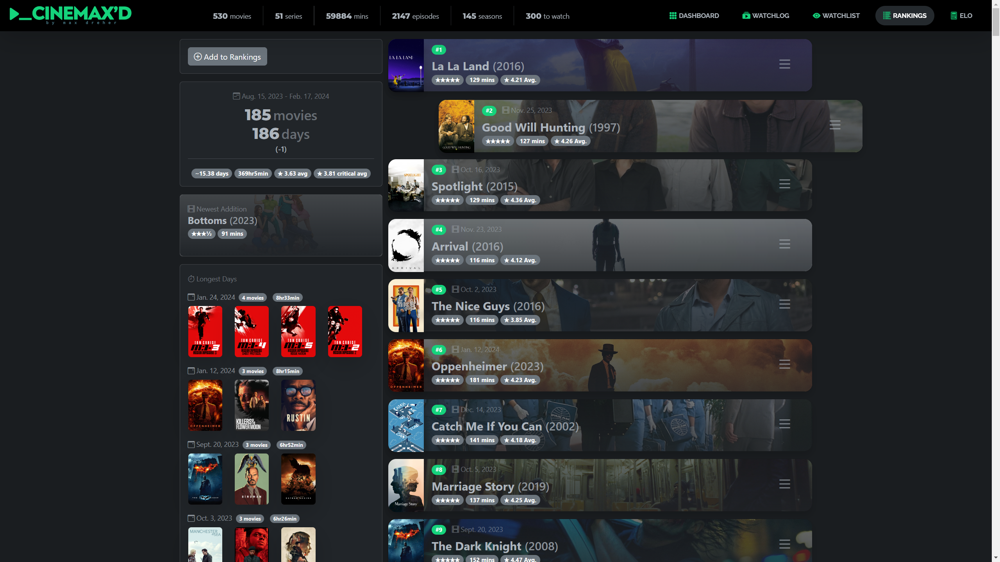
                <i>The Rankings page as of Feb. 17, 2024.</i>
            </td>
            <td align="center">
                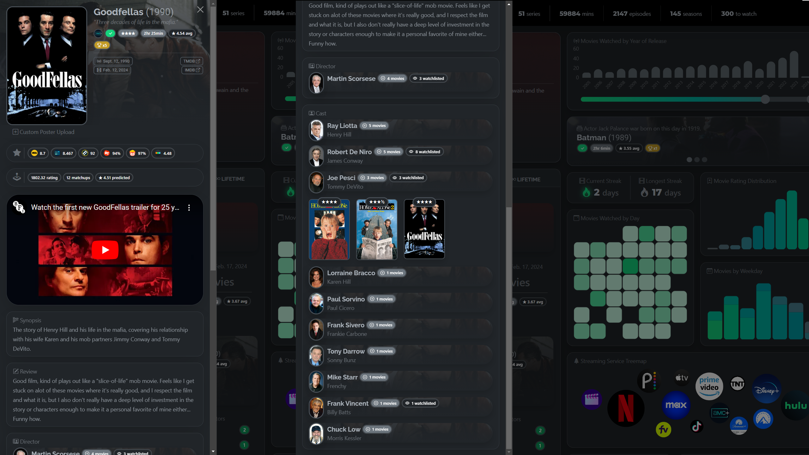
                <i>An Off-Canvas element for 'GoodFellas' as of Feb. 17, 2024.</i>
            </td>
        </tr>
    </table>

At this point, my priority shifted to a re-design of my models, and updates to my data pipelines. This iteration of designs carried through all of March and April, with the Dashboard reaching its final iteration within this design in late April.

    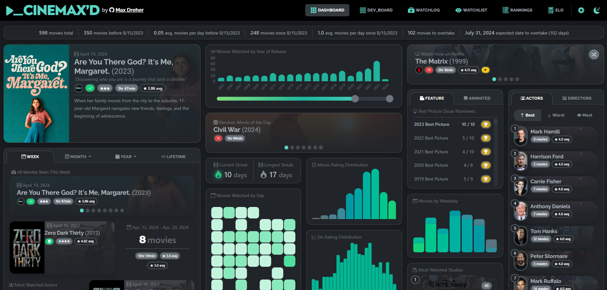
    
<i>The Dashboard page as of April 19, 2024.</i>

Around this point, I elected to re-design each page substantially, resulting in the version described by the rest of this writing.

