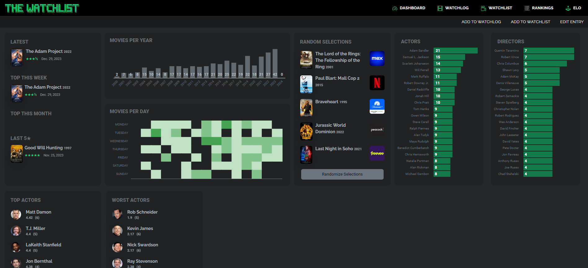

# 

A personal-use web application designed in Django to gain experience with front-end and back-end tools while integrating it with a hobby of mine.

#### Major Technologies Used:
- HTML/CSS
- JavaScript
- Python
- Django
- Bootstrap 5.3
- JQuery

## Pages

#### Dashboard
This page features several figures generated by the [amCharts 5](https://www.amcharts.com/) library, as well as numerous elements I've designed myself to display certain statistics.

Some of these include:
- Current week statistics
- Statistics by Month (Past 12mo. selectable)
- Statistics by Year (2023 - Present)
- "On-This-Day" tracking, with birthdays and movies released on the current date.
- Random movies from my Watchlist avaialable on streaming
- Current and all-time "days-in-a-row" streak.
- Best Picture by year tracking.
- Highest/Lowest rated and most watched actors/directors.

#### Watchlog
The functionality for the tables comes from the [DataTables](https://datatables.net/) libary, with the [SearchPanes](https://datatables.net/extensions/searchpanes/) extension providing filtering capability. These elements have been heavily customized to fit this use-case. The entry form is processed via AJAX and refreshes the table and search panes without reloading the entire page. In addition, an AJAX request is sent when a movie's title and year are entered that retrieves the film's poster from the TMDB API, so there is some amount of "user-verification" when recording an entry.

#### Watchlist

#### Movie Popouts
These elements are created using Bootstrap's offcanvas elements, and can be triggered by clicking the title of a film from any page. These elements contain more detailed information about the movie than can be displayed on the Dashboard or Tables, while also not requiring another webpage entirely. This element is created via AJAX when a film is clicked, and destroyed when another is clicked, as to never be storing more than one on the page at a time.

#### People Popouts
Just as film titles can be clicked, people's names will also pop-out an element displaying information about them as both a director and actor.

#### Poster-Selector
This element uses an AJAX request to make an API call gathering all existing posters for a film, and providing a quick selector to choose which one the app will primarily use. This feature is inspired directly by [Letterboxd's](https://letterboxd.com/) similar feature in their paid version.

## WIP

These pages are functional, but have not been brought to the design standard of the rest of the site yet.

#### Rankings
This page is a sortable list of the movies I've seen while trying to keep up with "a movie every day." The elements are drag-and-droppable in place, using [JQueryUI](https://jqueryui.com/sortable/#default). 

Future scope for this page is to update the design to be in-line with the rest of the website, and to remove the need to manually add new movies to the list via form, moving to something like a selector.

#### Elo
This page is a long-term project that uses a simple [Elo scoring algorithm](https://en.wikipedia.org/wiki/Elo_rating_system) to rank movies based on my head-to-head inputs. In theory, this was implemented to help me combat bias, most notably recency bias, in my ratings. 

A film is assigned an initial score based on the rating it's given. a 0.5 rating is given 1000 elo, while a 5.0 rating is given 1900. There is a K-factor of 32, so the most a movie could gain or lose from a single match is 32pts, with an average gain/loss of 16pts. 

This score is then modified by head-to-head matches, and a "predicted" score based on elo is given on the popout element mentioned above. 

The large amount of entries makes this impractical at some level without thousands upon thousands of matchups, but it has lead to some interesting results in its infancy. Most notably, "Black Swan," which I rated at 4.5 stars, has a rating of nearly 2100 after 15 matchups, which would not only estimate it at 5 stars, but as one of the highest rated movies in the entire database.

Future scope for this page includes updated design, as well as alternative matchup methods, such as random movies within a range of scores.

## Database Design

This project is built using a relational database schema using Django's models. This schema can be summarized by the following ERD:

The decision to seperate "Watchlog" and "Watchlist" is largely driven by certain instances where the distinction between both is helpful; however, it is my intention to eliminate this at some point given the redundancy of two models with so many similarities. At the very least moving them to a super-class/sub-class scheme.

## Progress
I started this project to replace a spreadsheet I had been working on between August 2023 - November 2023 because it would allow me so much more freedom in my design and statistics.

    
    

I began working on this project in December 2023, and had a "working" Dashboard and Watchlog page by 12/31/2023.

    

These have seen substantially overhauled, of course, and were re-designed heavily by 01/24/2024, with the addition of a few new features as well.

    
    

The version detailed in the rest of this page is the current updates, as of 02/17/2024.